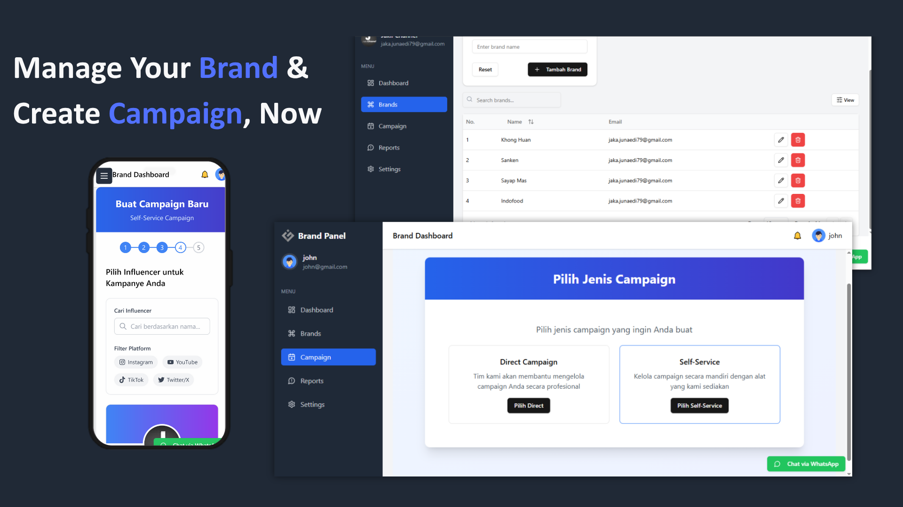

# Application KOL (Key Opinion Leader) Form with Nextjs 14, Zustand, and Zod Validation

A multi-step campaign creation form built using Nextjs 14, Zustand for status management, and Zod for schema validation. This form captures personal information, campaign type, campaign objective, and influencer criteria, with validation to ensure the accuracy of the entered data.




## Getting Started

1.  **Clone the repository:**

    ```bash
    git clone https://github.com/gayatriindonesia/kol-platform.git
    ```

2.  **Install Dependencies**

    ```bash
    npm install
    ```

3.  **Run the development server**

    ```bash
    npm run dev
    ```

    Open http://localhost:3000 in your browser to see the app in action.

## Deployment

To Deploy this app, you can use platforms like Vercel or Netlify. Ensure you have your environment variables set correctly on the chosen platform.

## License

This project is open source and available under the [MIT Licence](./LICENCE).
